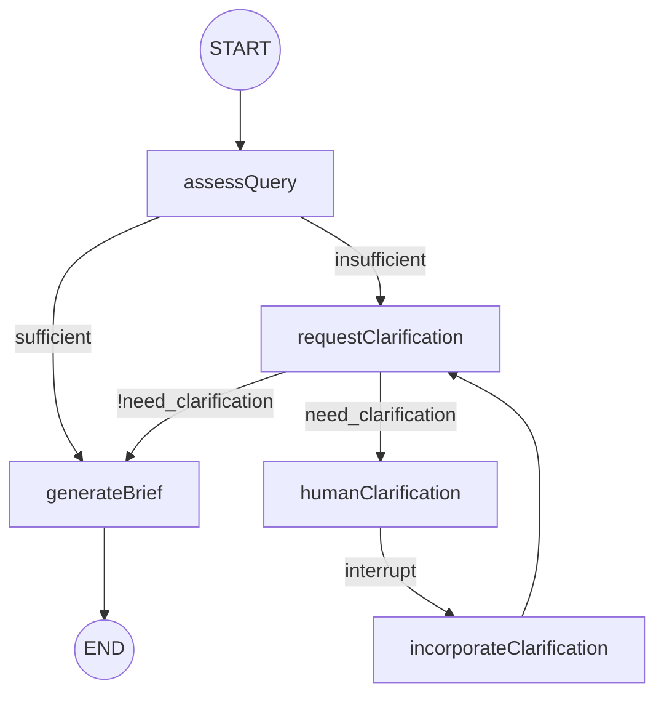

# Deep Research — Local Setup

This project is a full-stack deep research application. The backend exposes a `/research` endpoint backed by a LangGraph agent. The frontend folder is reserved for a future UI.

## Prerequisites

- Node.js 20+
- npm 10+
- (Optional) [LangGraph Studio](https://langchain-ai.github.io/langgraph/concepts/langgraph_studio/) desktop app for visual debugging

## Project layout

```
deep-research/
├── backend/          # Express + LangGraph API
├── frontend/         # Reserved (empty for now)
└── docs/             # Runbooks and testing guides
```

## Backend setup

1. Install dependencies:

```bash
cd backend
npm install
```

2. Environment variables are already in `backend/.env` for local development. For a fresh clone, copy the example file:

```bash
cp .env.example .env
```

3. Start the API server:

```bash
npm run dev
```

The server runs at `http://localhost:3001`.

## Graph behavior

The research graph has five nodes:

1. **assessQuery** — decides whether the user query is specific enough
2. **requestClarification** — evaluates `ClarifyWithUser` schema (`need_clarification`, `question`, `verification`)
3. **humanClarification** — pauses execution and waits for human input (human-in-the-loop)
4. **incorporateClarification** — merges the human response into messages and enriched query
5. **generateBrief** — produces `ResearchQuestion.research_brief` from message history



## State schema

Aligned with `state_scope.py` (`AgentState`, `ClarifyWithUser`, `ResearchQuestion`). See [graph-dry-run.md](./graph-dry-run.md) for full field reference and step-by-step scenarios.

## API

### `GET /health`

Health check.

### `POST /research`

Request body:

```json
{
  "query": "Your research question"
}
```

Response when clarification is needed (graph pauses for human input):

```json
{
  "status": "needs_clarification",
  "threadId": "uuid-for-this-run",
  "query": "...",
  "assessmentReason": "...",
  "need_clarification": true,
  "question": "...",
  "verification": "",
  "interrupt": { "value": { "action": "await_clarification", "question": "..." } }
}
```

Resume with the same `threadId` and your answers:

```json
{
  "threadId": "uuid-from-previous-response",
  "clarificationResponse": "Your answers to the clarification questions"
}
```

Response when the brief is generated:

```json
{
  "status": "complete",
  "query": "...",
  "assessmentReason": "...",
  "need_clarification": false,
  "verification": "...",
  "research_brief": "..."
}
```

## Switching LLM providers

Set `LLM_PROVIDER` in `.env`:

- `openai` (default) — uses `OPENAI_API_KEY` and `OPENAI_MODEL`
- `anthropic` — uses `ANTHROPIC_API_KEY` and `ANTHROPIC_MODEL`

## Production build

```bash
npm run build
npm start
```

## Next steps

- See [langgraph-studio.md](./langgraph-studio.md) to debug the graph visually
- See [testing.md](./testing.md) for curl examples and LangSmith verification
