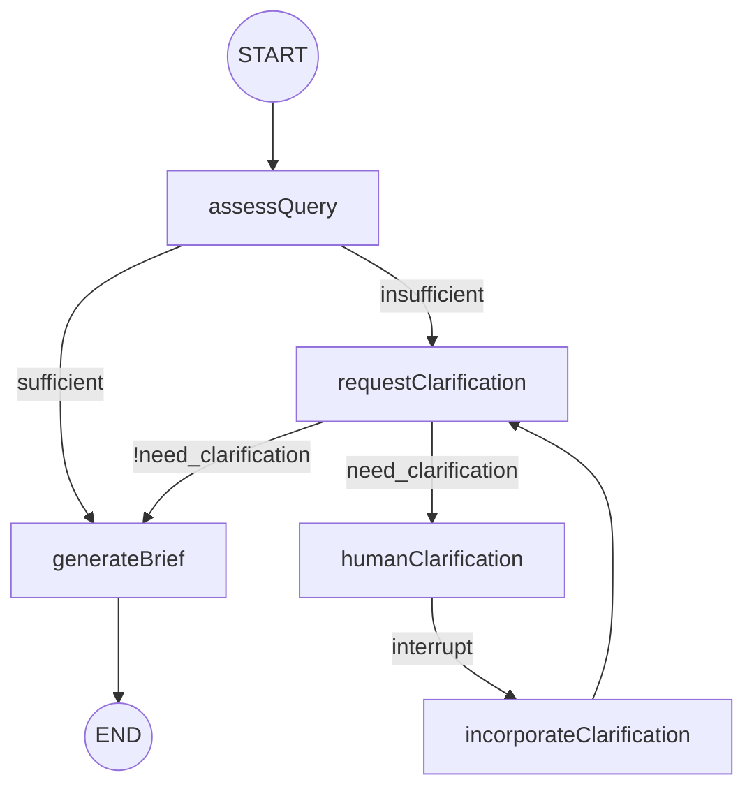

# Research Graph — Dry Run Scenarios

This document walks through four end-to-end scenarios for the `research` graph, showing **graph state at each checkpoint**. Values are from real API runs against the current implementation. Human-in-the-loop (HITL) via `interrupt()` is preserved.

## Schema alignment

State and structured outputs mirror `state_scope.py`:

### AgentState (graph state)

| Field | Type | Python equivalent | Set by |
|---|---|---|---|
| `messages` | `BaseMessage[]` | `MessagesState.messages` | Input / `requestClarification` / `incorporateClarification` |
| `researchBrief` | `string \| undefined` | `research_brief` | `generateBrief` |
| `supervisorMessages` | `BaseMessage[]` | `supervisor_messages` | Reserved |
| `rawNotes` | `string[]` | `raw_notes` | Reserved |
| `notes` | `string[]` | `notes` | Reserved |
| `finalReport` | `string` | `final_report` | Reserved |
| `needClarification` | `boolean` | `ClarifyWithUser.need_clarification` | `requestClarification` |
| `question` | `string` | `ClarifyWithUser.question` | `requestClarification` |
| `verification` | `string` | `ClarifyWithUser.verification` | `requestClarification` |
| `query` | `string` | — (workflow helper) | Input / `incorporateClarification` |
| `sufficient` | `boolean` | — (workflow helper) | `assessQuery` |
| `assessmentReason` | `string` | — (workflow helper) | `assessQuery` |
| `humanResponse` | `string` | — (HITL helper) | `humanClarification` |
| `enrichedQuery` | `string` | — (workflow helper) | `incorporateClarification` |
| `status` | `"needs_clarification" \| "complete"` | — (workflow helper) | `requestClarification` / `generateBrief` |

### ClarifyWithUser (structured output)

```typescript
{
  need_clarification: boolean;
  question: string;
  verification: string;
}
```

### ResearchQuestion (structured output)

```typescript
{
  research_brief: string;  // research question guiding the research
}
```

## Graph overview



---

## Scenario 1 — Detailed query (fast path)

**Input:** Specific query that passes `assessQuery` immediately.

**User query:**
> For a mid-size fintech in the EU, analyze real-time AML transaction monitoring using graph databases vs rule engines. Focus on PSD2/AML6, 18-month cost, false-positive rates. Audience: CTO and compliance lead.

**Path:** `START → assessQuery → generateBrief → END`

### Checkpoint 0 — Initial state

```json
{
  "query": "For a mid-size fintech in the EU, analyze real-time AML...",
  "messages": [{ "type": "human", "content": "For a mid-size fintech in the EU..." }],
  "supervisorMessages": [],
  "rawNotes": [],
  "notes": [],
  "researchBrief": undefined,
  "finalReport": "",
  "needClarification": false,
  "question": "",
  "verification": "",
  "sufficient": false,
  "status": "needs_clarification"
}
```

### Checkpoint 1 — After `assessQuery`

```json
{
  "sufficient": true,
  "assessmentReason": "The query is specific as it clearly defines the topic (real-time AML transaction monitoring), the intended audience (CTO and compliance lead), and the scope (mid-size fintech in the EU, focusing on PSD2/AML6, with specific metrics like cost and false-positive rates over 18 months)."
}
```

**Router:** `sufficient === true` → `generateBrief` (skips clarification and HITL).

### Checkpoint 2 — After `generateBrief` (final)

**ResearchQuestion output:**

```json
{
  "research_brief": "How do real-time AML transaction monitoring systems using graph databases compare to those using rule engines in terms of effectiveness and efficiency for a mid-size fintech in the EU, specifically focusing on the implications of PSD2 and AML6 regulations, with an analysis of the 18-month cost and false-positive rates, aimed at informing the CTO and compliance lead?"
}
```

**API response:**

```json
{
  "status": "complete",
  "threadId": "84662a44-61cc-4b51-b29f-0075dd569f40",
  "need_clarification": false,
  "research_brief": "How do real-time AML transaction monitoring systems using graph databases compare..."
}
```

---

## Scenario 2 — Vague query (HITL interrupt)

**Input:** Query too vague for `assessQuery`.

**User query:** `AI trends`

**Path:** `START → assessQuery → requestClarification → humanClarification` **⏸ INTERRUPT**

### Checkpoint 1 — After `assessQuery`

```json
{
  "sufficient": false,
  "assessmentReason": "The query 'AI trends' is too vague and lacks specificity regarding the intended audience, scope (such as timeframe or industry), and desired output."
}
```

### Checkpoint 2 — After `requestClarification`

**ClarifyWithUser output:**

```json
{
  "need_clarification": true,
  "question": "Could you specify which aspects of AI trends you are interested in? For example, are you looking for trends in specific industries, technological advancements, ethical considerations, or something else?",
  "verification": ""
}
```

**State updates:**

```json
{
  "needClarification": true,
  "question": "Could you specify which aspects of AI trends you are interested in?...",
  "verification": "",
  "status": "needs_clarification",
  "messages": [
    { "type": "human", "content": "AI trends" },
    { "type": "ai", "content": "Could you specify which aspects of AI trends..." }
  ]
}
```

**Router:** `needClarification === true` → `humanClarification`.

### Checkpoint 3 — At `humanClarification` interrupt (paused)

```json
{
  "action": "await_clarification",
  "need_clarification": true,
  "query": "AI trends",
  "question": "Could you specify which aspects of AI trends..."
}
```

**API response:**

```json
{
  "status": "needs_clarification",
  "threadId": "916512ca-85d2-4c87-9bd2-91305a910443",
  "need_clarification": true,
  "question": "Could you specify which aspects of AI trends...",
  "verification": "",
  "interrupt": { "id": "9a1ef7352c99c87b6aa355d9b50f525b", "value": { "action": "await_clarification" } }
}
```

---

## Scenario 3 — Resume after human clarification (full HITL loop)

**Continuation of Scenario 2.**

**Resume payload:**

```json
{
  "threadId": "916512ca-85d2-4c87-9bd2-91305a910443",
  "clarificationResponse": "Focus on generative AI in US healthcare for 2025-2026. Audience: product strategy team. Output: executive brief with 3-5 recommendations."
}
```

**Path (resume):** `humanClarification → incorporateClarification → requestClarification → generateBrief → END`

### Checkpoint 4 — After `humanClarification` (resume)

```json
{
  "humanResponse": "Focus on generative AI in US healthcare for 2025-2026. Audience: product strategy team. Output: executive brief with 3-5 recommendations."
}
```

### Checkpoint 5 — After `incorporateClarification`

`enrichedQuery` is built by concatenating the original `query`, a separator, and the human's clarification response:

```
AI trends

User clarification:
Focus on generative AI in US healthcare for 2025-2026. Audience: product strategy team. Output: executive brief with 3-5 recommendations.
```

```json
{
  "query": "AI trends\n\nUser clarification:\nFocus on generative AI in US healthcare for 2025-2026. Audience: product strategy team. Output: executive brief with 3-5 recommendations.",
  "enrichedQuery": "AI trends\n\nUser clarification:\nFocus on generative AI in US healthcare for 2025-2026. Audience: product strategy team. Output: executive brief with 3-5 recommendations.",
  "messages": [
    { "type": "human", "content": "AI trends" },
    { "type": "ai", "content": "Could you specify which aspects of AI trends you are interested in? For example, are you looking for trends in specific industries, technological advancements, ethical considerations, or something else?" },
    { "type": "human", "content": "Focus on generative AI in US healthcare for 2025-2026. Audience: product strategy team. Output: executive brief with 3-5 recommendations." }
  ]
}
```

**Edge:** `incorporateClarification → requestClarification` (re-evaluation loop).

### Checkpoint 6 — After `requestClarification` (second pass)

**ClarifyWithUser output:**

```json
{
  "need_clarification": false,
  "question": "",
  "verification": "I have sufficient information to proceed with the research. You are interested in generative AI trends in US healthcare for 2025-2026, specifically for a product strategy team, and you require an executive brief with 3-5 recommendations. I will now begin the research process."
}
```

**Router:** `needClarification === false` → `generateBrief`.

### Checkpoint 7 — After `generateBrief` (final)

**ResearchQuestion output:**

```json
{
  "research_brief": "What are the anticipated trends and applications of generative AI in the US healthcare sector for the years 2025-2026, and what 3-5 strategic recommendations can be made for a product strategy team to effectively leverage these trends?"
}
```

**API response:**

```json
{
  "status": "complete",
  "threadId": "916512ca-85d2-4c87-9bd2-91305a910443",
  "query": "AI trends\n\nUser clarification:\nFocus on generative AI in US healthcare for 2025-2026. Audience: product strategy team. Output: executive brief with 3-5 recommendations.",
  "enrichedQuery": "AI trends\n\nUser clarification:\nFocus on generative AI in US healthcare for 2025-2026. Audience: product strategy team. Output: executive brief with 3-5 recommendations.",
  "need_clarification": false,
  "verification": "I have sufficient information to proceed with the research. You are interested in generative AI trends in US healthcare for 2025-2026, specifically for a product strategy team, and you require an executive brief with 3-5 recommendations. I will now begin the research process.",
  "research_brief": "What are the anticipated trends and applications of generative AI in the US healthcare sector for the years 2025-2026, and what 3-5 strategic recommendations can be made for a product strategy team to effectively leverage these trends?"
}
```

---

## Scenario 4 — Borderline query (clarification skipped by prompt)

**Input:** Partially scoped query where `assessQuery` says insufficient, but `requestClarification` decides to proceed.

**User query:** `Compare Pinecone and Weaviate for a RAG app`

**Path:** `START → assessQuery → requestClarification → generateBrief → END`

### Checkpoint 1 — After `assessQuery`

```json
{
  "sufficient": false,
  "assessmentReason": "The query lacks details about the intended audience, specific use cases for the RAG app, and any scope boundaries such as timeframe or industry."
}
```

### Checkpoint 2 — After `requestClarification`

**ClarifyWithUser output** (proceeds without HITL):

```json
{
  "need_clarification": false,
  "question": "",
  "verification": "I have sufficient information to proceed with the comparison of Pinecone and Weaviate for a RAG app. I will now begin the research process."
}
```

**Router:** `needClarification === false` → `generateBrief` directly (no `humanClarification` interrupt).

### Checkpoint 3 — After `generateBrief` (final)

```json
{
  "research_brief": "What are the comparative strengths and weaknesses of Pinecone and Weaviate in the context of building a Retrieval-Augmented Generation (RAG) application, specifically focusing on aspects such as scalability, ease of integration, performance metrics, supported data types, and community support, while considering any additional relevant dimensions that may impact the effectiveness of each platform?"
}
```

---

## Scenario comparison

| Scenario | Input | Path | HITL? | Final `research_brief` |
|---|---|---|---|---|
| 1 — Fast path | Detailed AML query | `assessQuery → generateBrief` | No | Yes |
| 2 — Interrupt | `AI trends` | `assessQuery → requestClarification → humanClarification` | Paused | No |
| 3 — Resume | Vague + human answer | Full loop with 2nd `requestClarification` | Yes | Yes |
| 4 — Borderline | Pinecone vs Weaviate | `assessQuery → requestClarification → generateBrief` | No | Yes |

## Node execution counts

| Scenario | LLM calls | Human steps |
|---|---|---|
| 1 | 2 (`assessQuery`, `generateBrief`) | 0 |
| 2 | 2 (`assessQuery`, `requestClarification`) | 0 (waiting) |
| 3 | 4 (`assessQuery`, `requestClarification` ×2, `generateBrief`) | 1 resume |
| 4 | 3 (`assessQuery`, `requestClarification`, `generateBrief`) | 0 |

## Key behaviors

1. **`ClarifyWithUser` is the authority for clarification decisions** — field names match Python: `need_clarification`, `question`, `verification`.

2. **`ResearchQuestion.research_brief` is the final scoping output** — a single research question, not a multi-section report.

3. **HITL triggers only when `need_clarification: true`** after `requestClarification`. The graph pauses at `humanClarification` via `interrupt()`.

4. **After human input, the graph loops to `requestClarification`** to re-evaluate message history before generating the brief.

5. **Reserved AgentState fields** (`supervisorMessages`, `rawNotes`, `notes`, `finalReport`) are initialized empty and ready for future research phases.
